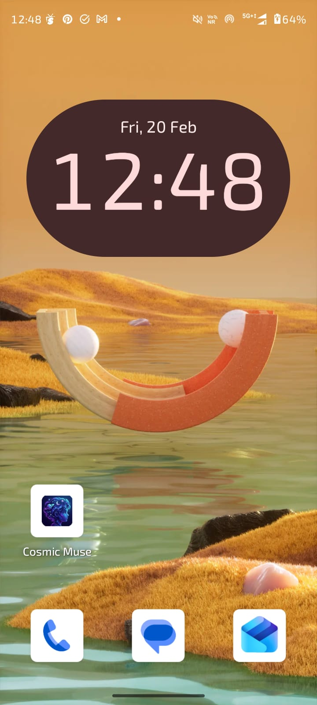
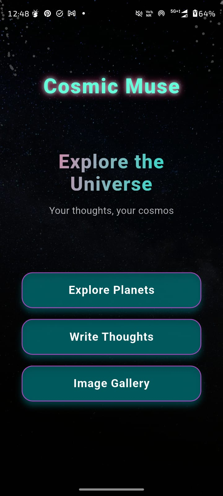
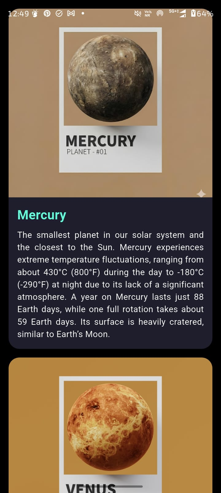
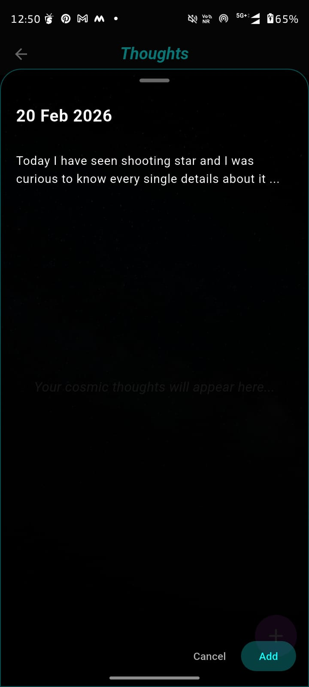
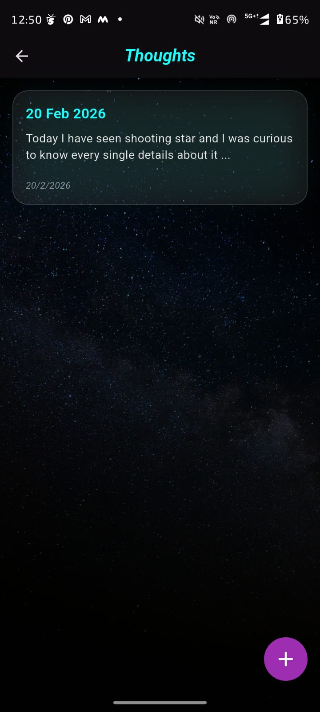
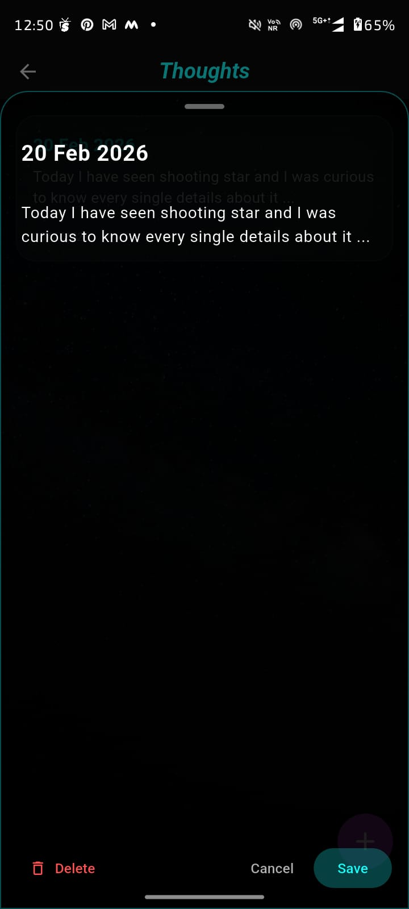
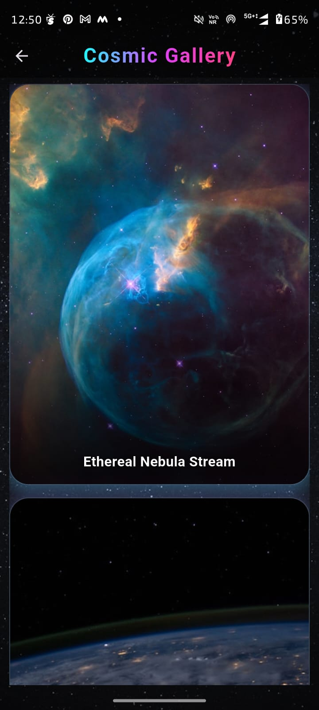
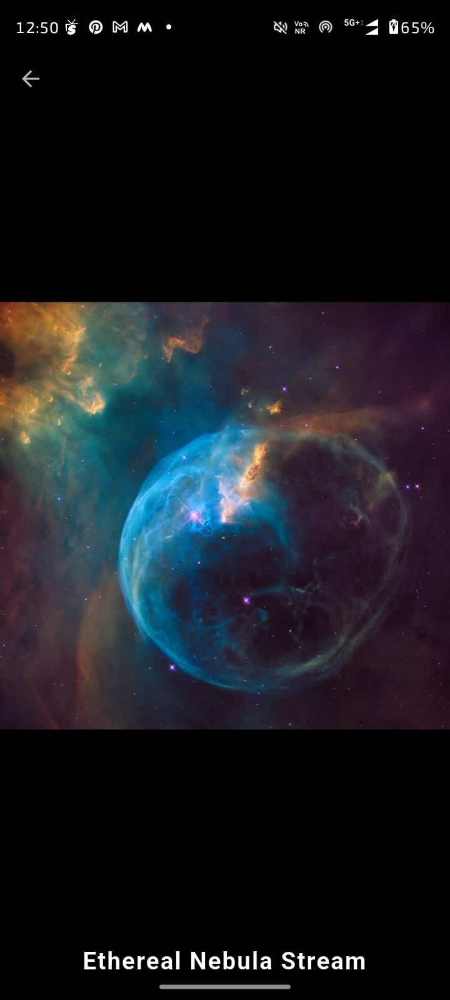

# 🌌 Cosmic Muse

### *Where thoughts float like stars…*

Cosmic Muse is a space-inspired journaling and note-capturing Android application that I built while learning mobile app development.

This project is very close to me because it is my **first complete Android app** — developed from scratch during my learning phase. I didn’t just want to build a notes app… I wanted to build a *feeling* — something calm, cosmic, and personal.

So Cosmic Muse became my little universe where thoughts can exist freely ✨

---
## 🚀 The Idea Behind Cosmic Muse

Sometimes thoughts feel bigger than words — like constellations forming slowly in the mind.

I wanted an app where writing feels peaceful instead of mechanical.
No clutter. No noise. Just you… and your thoughts… floating in space.

Cosmic Muse is designed for:

* Dreamers 🌙
* Writers ✍️
* Overthinkers 💭
* Late-night thinkers 🌌

---

## ✨ Main Features

🌠 **Cosmic UI Experience**
A deep-space themed interface designed to make writing feel immersive and calming.

📝 **Quick Thought Capture**
Write, edit, and save notes instantly whenever inspiration strikes.

🎨 **Minimal & Clean Layout**
No distractions — just a smooth writing environment.

📱 **Responsive Design**
Optimized layouts for mobile devices and larger screens.

⚡ **Smooth Performance**
Lightweight Flutter build ensuring fast interactions.

---

## 🛠️ Built With

* **Flutter**
* **Dart**
* **Android Studio**
* **Material UI**

This project helped me understand real app structuring, UI building, navigation flow, and asset integration in Flutter.

---

## 📸 Application Screenshots

### 📱 Mobile View
<div align="center">

<table>
<tr>
<td></td>
<td></td>
<td></td>
<td></td>
</tr>
<tr>
<td></td>
<td></td>
<td></td>
<td></td>
</tr>
</table>

</div>


## 📂 Project Structure

```
lib/
 ┣ screens/
 ┗ main.dart

assets/
 ┗ cosmic_backgrounds/

android/
web/
```

---

## 🌱 What I Learned

Building Cosmic Muse taught me more than tutorials ever could:

* Structuring a complete Flutter app
* Designing aesthetic UI themes
* Handling navigation & state
* Managing assets & backgrounds
* Making responsive layouts
* Debugging real development errors

Most importantly — it gave me confidence that I can build real apps from my ideas.

---

## 🔮 Future Improvements

This universe is still expanding…

Planned features:

* ☁️ Cloud note backup
* 🔒 Login & security
* 🌓 Theme customization
* 📅 Date-wise journals
* 🔔 Thought reminders

---

## 👩‍💻 Author

**Payal Chandrapal Chapre** 
Android Developer (Learner) | AI-ML Enthusiast | Astronomy Lover 🌙

This is just the beginning of my Android journey — many more apps are on the way 🚀

---

## ⭐ Support

If you like the project, consider giving it a star — it motivates me to build more cosmic experiences ✨


